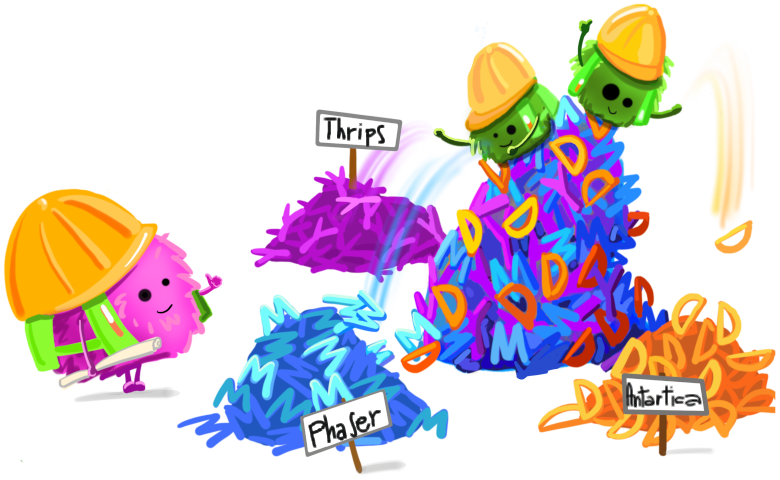
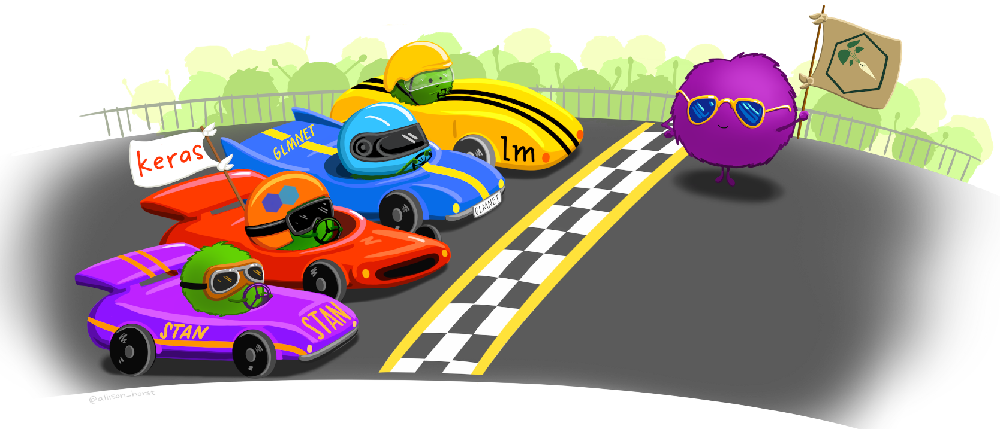
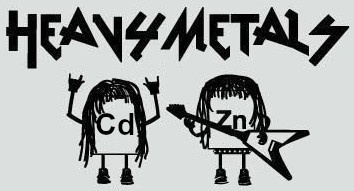
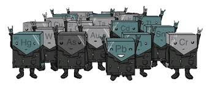
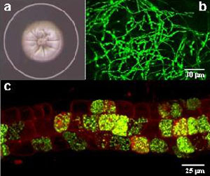
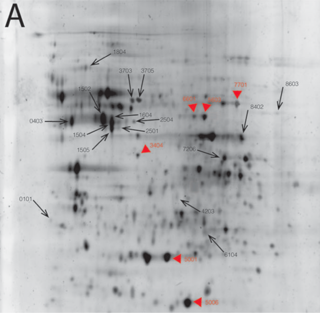
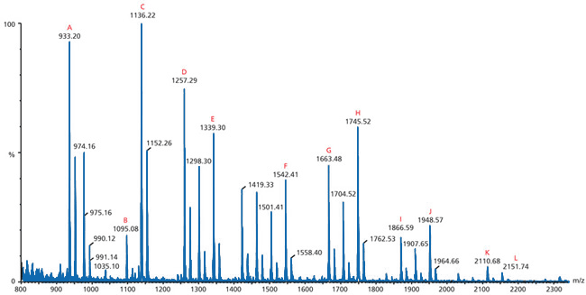
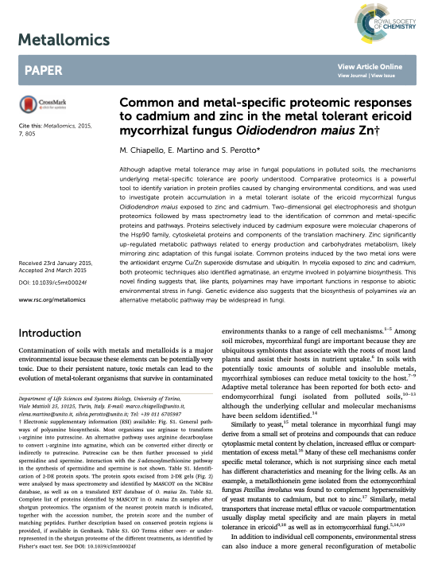

```{r setup, include=FALSE, cache=FALSE}
# TO render: rmarkdown::render('Lesson3.Rmd', 'xaringan::moon_reader')

# set working directory to docs folder
setwd(here::here())

# Set global R options
options(htmltools.dir.version = FALSE, servr.daemon = TRUE)

# Set global knitr chunk options
knitr::opts_chunk$set(
  fig.align = "center", 
  cache = TRUE,
  error = FALSE,
  message = FALSE, 
  warning = FALSE, 
  collapse = TRUE 
)

# This is good for getting the ggplot background consistent with
# the html background color
# library(ggplot2)
# thm <- theme_bw()
# theme_set(thm)

# library(RefManageR)
# BibOptions(check.entries = FALSE,
#            bib.style = "authoryear",
#            cite.style = "authoryear",
#            style = "markdown",
#            hyperlink = FALSE,
#            max.names = 2,
#            dashed = FALSE)
# bib <- ReadBib("biblio/bib.bib", check = FALSE)
```

```{r xaringanExtra, echo=FALSE}
library(xaringanExtra)
use_tile_view() 
#use_scribble()
use_animate_css()
# use_logo(image_url = "images/IPSPweb_ITA.jpg")
use_search(show_icon = FALSE)
```

class: title-slide hide_logo


# .font120[.center[Fungal interactions]]
# .font100[.center[from bioremediation to biocontrol agents]] 
# .font100[.center[through mycorrhizal symbiosis]]


<br><br>
.marco[
.tada[Marco Chiapello]
<br>
2021-03-29
]

.rigth[Seminario - Istituto per la Protezione Sostenibile delle Piante]

???

.parR[
Buongiorno a tutti
]

---

class: clear

# .center[.black[Overview]]

.pull-left[
- Su cosa ho lavorato in passato
.m0p[
```{r echo = FALSE, out.width="150px"}

```
]

-  Su cosa sto lavorando ora
.m0p[
```{r echo = FALSE, out.width="150px"}

```
]

]


.pull-right[
- Side-projects
.m0p[
```{r echo = FALSE, out.width="250px"}

```
]

- Su cosa vorrei lavorare
.m0p[
```{r echo = FALSE, out.width="250px"}

```
]

.font50[.right[.grey[Credits to @Allisonhorst]]]
]

???

.h201[

In questa breve presentazione vorrei provare a raccontarvi chi sono, su cosa ho lavorato e quali esperienze mi hanno portato fino a qui.

- Vorrei iniziare con un salto nel passato raccontandovi le esperienze fatte prima del mio arrivo all'IPSP
 
- Di cosa mi sono occupato nei 2 anni di lavoro presso la sede di Torino
 
- Vorrei anche dedicare qualche parola ad alcuni side projects o collaborazioni particolarmente significative
 
- Ed infine illustrarvi quali potrebbero essere i lavori futuri

]

---

layout: true

class: clear
# .center[.black[Overview]]

---

background-image: url("images/overview1.png")
background-size: contain

???

.h202[
- Il filo conduttore e la forza trainante della mia ricerca sono sempre stati i funghi
]

---

background-image: url("images/overview2.png")
background-size: contain

???

.h202[
- All'Universita degli Studi di Torino nel 2006, ho iniziato il mio dottorato in Biologia e Biotecnologia dei Funghi, lavorando su 2 progetti: 
    - un fungo ericoide coinvolto nella detossificazione di suoli altamente inquinati da metalli pesanti
    - un fungo coinvolto nella detossificazione delle fibre di amianto

- La tecnica utilizzata per entrambi i progetti e stata la proteomica.

- Ci tengo a sottolinearlo perche, fino a prima di quello al CNR, tutti i precedenti contratti sono stati ottenuti in quanto esperto di proteomica
]

---

background-image: url("images/overview3.png")
background-size: contain

???

.h202[
- Dopo il dottorato, ho spostato il mio ambito di ricerca sui funghi micorrizici arbuscolari

- Ho iniziato un postDoc a Lausanne con Uta Paszkoswi su un progetto molto ambizioso: cioe identificare il proteoma della membrana periarbuscolare

- Nelle slide successive spieghero piu nel dettaglio il progetto e i risultati ottenuti
]
---

background-image: url("images/overview4.png")
background-size: contain

???

.h202[
- Infine, nell'ambito del progetto europeo H2020: VIROPLANT, coordinato da massimo Turina,
mi sono occupato di identificare il viroma di Plasmopara viticola, un oomicete causa della peronospora della vite.

- Per questa presentazione ho deciso di focalizzarmi su 3 macro settori e per ognuno di essi vorrei raccontarvi una storia
]

---

layout: true

# Bioremediation

---

class: inverse, middle, center 

----

---

background-image: url("images/niep1.jpg")
background-size: contain

???

.h202[
- Questa e la foresta di Niepolomice in polonia, un posto bellissimo

- Purtroppo nella seconda meta' dello scorso secolo l'industrializzazione ha causato l'innalzamento delle concentrazioni di metalli pesanti nel terreno riducendo drasticamente la flora della foresta

- La prima pianta che riusci a ricolonizzare le zone piu' altamente inquinate fu Vaccinium myrtillus

- La resistenza alle elevate concentrazioni di HM e' stato scoperto essere  conferita alla pianta da un fungo Ericoide che cresce in simbiosi con la pianta: *Oidiodendron maius*
]

---

.font120[**Cosa sono i metalli pesanti?**]

.pull-left[
.h202[
- Elementi metallici con una densita' maggiore di 5 g/cm3 (Adriano, 1986).

- Troviamo HM sia tra gli elementi essenziali sia tra gli elementi non essenziali
]

.font120[**Che effetti hanno?**]

.h202[
- **Diretti**: I metalli possono legarsi a biomolecole e interferire con il loro funzionamento

- **Indiretti**: I metalli possono causare un aumento delle specie reattive dell’ossigeno (ROS)
]
]

.pull-right[
.m0p[
```{r echo = FALSE, out.width="350px"}

```
]
<br>
.m0p[
```{r echo = FALSE, out.width="350px"}

```
]
]

???

.h202[

- Facciamo un passo indietro, cosa sono i HM?

- ...

- Che effetti hanno sugli esseri viventi?

]

---


.font120[*Oidiodendron maius*]

.pull-left[
.m0tp[
.par23[
- *O. maius*  Zn e' un fungo che forma simbiosi intracellulari con le radici di Ericaeae (micorrize ericoidi)

- *O. maius*  Zn e' stato isolato da terreni contenenti elevate concentrazione di zinco

- *O. maius*  Zn ha dimostrato elevata tolleranza sia a zinco che a cadmio (Martino et al. 2000)
]
]
]

    
.pull-right[
```{r echo=FALSE, out.width="350px"}

```
.font50[.right[.grey[Source: https://mycor.nancy.inra.fr]]]
]

.content-box-red2[
Studiare i meccanismi di difesa di *O. maius* nei confronti di Cadmio e Zinco
]
---

.font120[**Proteomics**]

.pull-left[
.font100[Gel-based]
.m0tp[
```{r echo=FALSE, out.width="350px"}

```
]
]

    
.pull-right[
.font100[Gel-free]
<br>
```{r echo=FALSE, out.width="550px"}

```
.right[.font50[(Chiapello et al., 2015)]]
]

???

.h202[
- Dopo aver fatto crescere il fungo in presenza di Cd o Zn 

- Sono state estratte le proteine ed e' stata studiata la loro espressione con due approcci complementari: 
    - La proteomica bidimensionale seguita da immunoblotting
    - Shotgun proteomics

- In particolare la parte di immunoblotting e' stata eseguita presso l'Universita' di Calgary in Canada, mentre la parte di shotgun proteomics e' stata eseguita al centro di proteomica di York
]


---

.pull-left[
.par25[
- **Risposte specifiche**

    - Zinco
    - Cadmio

- **Risposte comuni**

    - CU/Zn superoxide dismutase
    - Agmatinase
]
]
    
.pull-right[
```{r echo=FALSE, out.width="400px"}

```
]

???

.h202[
- Questa ricerca ha portato alla pubblicazione di un articolo che metteva in risalto le risposte specifiche e comuni del fungo alla presenza dei due metalli

- In particolare 
    - La presenza di zinco aumentava in maniera significativa il metabolismo legato alla produzione di energia e al metabolismo dei carboidrati
    - La presenza di cadmio induceva la produzione di chaperonine della famiglia HSP90 e proteine del citoscheletro 

- Le proteine comuni indotte dai due metalli erano Rame/zinco superossido dismutasi e l'ubiquitina, tra quelle note. 

- La scoperta fatta in questo lavoro e' stata la presenza di uan proteina chiamata agmatinase, un enzima coinvolto nella via di biosintesi delle poliamine. Queste proteine hanno importanti funzioni in risposta agli stress abiotici.
]
