```{r setup, include=FALSE, cache=FALSE}
# TO render: rmarkdown::render('Lesson3.Rmd', 'xaringan::moon_reader')

# set working directory to docs folder
setwd(here::here())

# Set global R options
options(htmltools.dir.version = FALSE, servr.daemon = TRUE)

# Set global knitr chunk options
knitr::opts_chunk$set(
  fig.align = "center", 
  cache = TRUE,
  error = FALSE,
  message = FALSE, 
  warning = FALSE, 
  collapse = TRUE 
)

# This is good for getting the ggplot background consistent with
# the html background color
# library(ggplot2)
# thm <- theme_bw()
# theme_set(thm)

# library(RefManageR)
# BibOptions(check.entries = FALSE,
#            bib.style = "authoryear",
#            cite.style = "authoryear",
#            style = "markdown",
#            hyperlink = FALSE,
#            max.names = 2,
#            dashed = FALSE)
# bib <- ReadBib("biblio/bib.bib", check = FALSE)
```

```{r xaringanExtra, echo=FALSE}
library(xaringanExtra)
use_tile_view() 
#use_scribble()
use_animate_css()
# use_logo(image_url = "images/IPSPweb_ITA.jpg")
use_search(show_icon = FALSE)
```

class: title-slide hide_logo


# .font120[.center[Fungal interactions]]
# .font100[.center[from bioremediation to biocontrol agents]] 
# .font100[.center[through mycorrhizal symbiosis]]


<br><br>
.marco[
.tada[Marco Chiapello]
<br>
2021-03-29
]

.rigth[Seminario - Istituto per la Protezione Sostenibile delle Piante]

???

.h202[
- Buongiorno a tutti
- Mi chiamo Marco Chiapello e sono ricercatore a tempo determinato della sede di Torino
- Oggi vorrei raccontarvi alcune delle esperieze e dei lavori significativi che ho fatto in questi anni e che mi hanno permesso di essere qui oggi
]

---
class: clear middle center

```{r echo = FALSE, out.width="650px"}
knitr::include_graphics("images/lubridate.png")
```

???

.h202[
- Vorrei cominciando questo viaggio nel passato raccontandovi tre storie  
]

---

layout: true

class: clear
# .center[.black[Overview]]

---

background-image: url("images/overview1.png")
background-size: contain

???

.h202[
- Il filo conduttore delle tre storie sara' lo studio dei funghi sotto diversi punti di vista]

---

background-image: url("images/overview2.png")
background-size: contain

???

.h202[
- All'Universita degli Studi di Torino nel 2006, ho iniziato il mio dottorato in Biologia e Biotecnologia dei Funghi, lavorando su 2 progetti: 
    - un fungo ericoide coinvolto nella detossificazione di suoli altamente inquinati da metalli pesanti
    - un fungo coinvolto nella detossificazione delle fibre di amianto

- La tecnica utilizzata per entrambi i progetti e stata la proteomica.

- Ci tengo a sottolinearlo perche, fino a prima di quello al CNR, tutti i precedenti contratti sono stati ottenuti in quanto esperto di proteomica
]

---

background-image: url("images/overview3.png")
background-size: contain

???

.h202[
- Dopo il dottorato, ho spostato il mio ambito di ricerca sui funghi micorrizici arbuscolari

- Ho iniziato un postDoc a Lausanne con Uta Paszkoswi su un progetto molto ambizioso: cioe identificare il proteoma della membrana periarbuscolare

- Nelle slide successive spieghero piu nel dettaglio il progetto e i risultati ottenuti
]
---

background-image: url("images/overview4.png")
background-size: contain

???

.h202[
- Infine, nell'ambito del progetto europeo H2020: VIROPLANT, coordinato da massimo Turina,
mi sono occupato di identificare il viroma di Plasmopara viticola, un oomicete causa della peronospora della vite.

]

---

layout: true

# Bioremediation

---

class: inverse, middle, center 

----

???

.h202[
- Iniziero' con il progetto del dottorato sullo studio della tolleranza ai metalli pesanti
]

---

background-image: url("images/niep1.jpg")
background-size: contain

???

.h202[
- Questa e la foresta di Niepolomice in polonia, un posto bellissimo

- Purtroppo nella seconda meta' dello scorso secolo l'industrializzazione ha causato l'innalzamento delle concentrazioni di metalli pesanti nel terreno riducendo drasticamente la flora della foresta

- La prima pianta che riusci a ricolonizzare le zone piu' altamente inquinate fu Vaccinium myrtillus

- La resistenza alle elevate concentrazioni di HM e' stato scoperto essere  conferita alla pianta da un fungo Ericoide che cresce in simbiosi con la pianta: *Oidiodendron maius*
]

---

.font120[**Cosa sono i metalli pesanti?**]

.pull-left[
.h202[
- Elementi metallici con una densita' maggiore di 5 g/cm3 (Adriano, 1986).

- Troviamo HM sia tra gli elementi essenziali sia tra gli elementi non essenziali
]

.font120[**Che effetti hanno?**]

.h202[
- **Diretti**: I metalli possono legarsi a biomolecole e interferire con il loro funzionamento

- **Indiretti**: I metalli possono causare un aumento delle specie reattive dell’ossigeno (ROS)
]
]

.pull-right[
.m0p[
```{r echo = FALSE, out.width="350px"}
knitr::include_graphics("images/metalli_pesanti.jpg")
```
]
<br>
.m0p[
```{r echo = FALSE, out.width="350px"}
knitr::include_graphics("images/metalli_pesanti2.jpg")
```
]
]

???

.h202[

- Facciamo un passo indietro, cosa sono i HM?

- ...

- Che effetti hanno sugli esseri viventi?

]

---


.font120[*Oidiodendron maius*]

.pull-left[
.m0tp[
.par23[
- *O. maius*  Zn e' un fungo che forma simbiosi intracellulari con le radici di Ericaeae (micorrize ericoidi)

- *O. maius*  Zn e' stato isolato da terreni contenenti elevate concentrazione di zinco

- *O. maius*  Zn ha dimostrato elevata tolleranza sia a zinco che a cadmio (Martino et al. 2000)
]
]
]

    
.pull-right[
```{r echo=FALSE, out.width="350px"}
knitr::include_graphics("images/oidiodendron_maius.jpg")
```
.font50[.right[.grey[Source: https://mycor.nancy.inra.fr]]]
]

.content-box-red2[
Studiare i meccanismi di difesa di *O. maius* nei confronti di Cadmio e Zinco
]


???

.h202[
- O maius ceppo Zinco e' stato isolato da terreni fortemente contaminati da metalli pesanti

- Proprio per questo ha sviluppato una elevata tolleranza a questi metalli in particolare Cadmio e Zinco

- Questo fungo e' in grado di sviluppare simbiosi intracellulari con piante della famiglia Ericaceae

- Obiettivo del progetto e' stata l'investigazione dei meccanismi di tolleranza di questo fungo a Cadmio e Zinco
]
---

.font120[**Proteomics**]

.pull-left[
.font100[Gel-based]
.m0tp[
```{r echo=FALSE, out.width="350px"}
knitr::include_graphics("images/gelBased.png")
```
]
]

    
.pull-right[
.font100[Gel-free]
<br>
```{r echo=FALSE, out.width="550px"}
knitr::include_graphics("images/ms-spectra.png")
```
.right[.font50[(Chiapello et al., 2015)]]
]

???

.h202[
- Dopo aver fatto crescere il fungo in presenza di Cd o Zn 

- Sono state estratte le proteine ed e' stata studiata la loro espressione con due approcci complementari: 
    - La proteomica bidimensionale seguita da immunoblotting
    - Shotgun proteomics

- In particolare la parte di immunoblotting e' stata eseguita presso l'Universita' di Calgary in Canada, mentre la parte di shotgun proteomics e' stata eseguita al centro di proteomica di York
]


---

.pull-left[
.par25[
- **Risposte specifiche**

    - Zinco
    - Cadmio

- **Risposte comuni**

    - CU/Zn superoxide dismutase
    - Ubiquitin
    - Agmatinase
]
]
    
.pull-right[
```{r echo=FALSE, out.width="400px"}
knitr::include_graphics("images/chiapello2015.png")
```
]

???

.h202[
- Questa ricerca ha portato alla pubblicazione di un articolo che metteva in risalto le risposte specifiche e comuni del fungo alla presenza dei due metalli

- In particolare 
    - La presenza di zinco aumentava in maniera significativa il metabolismo legato alla produzione di energia e al metabolismo dei carboidrati
    - La presenza di cadmio induceva la produzione di chaperonine della famiglia HSP90 e proteine del citoscheletro 

- Le proteine comuni indotte dai due metalli erano Rame/zinco superossido dismutasi e l'ubiquitina, tra quelle note. 

- La scoperta fatta in questo lavoro e' stata la presenza di uan proteina chiamata agmatinase, un enzima coinvolto nella via di biosintesi delle poliamine. Queste proteine hanno importanti funzioni in risposta agli stress abiotici.
]

---

layout: true

# Arbuscular Mycorrhizal Fungi

---

class: inverse, middle, center 

----

---

.pull-left[
.m0tp[
.par25[
- Oltre l'80% delle piante forma una simbiosi micorrizica arbuscolare

- E' la simbiosi piu' antica

- Ha probabilmente avuto un ruolo nella colonizzazione delle terre emerse 450 MYA

]
]
]
    
.pull-right[
.m0tp[
```{r echo=FALSE, out.width="450px"}
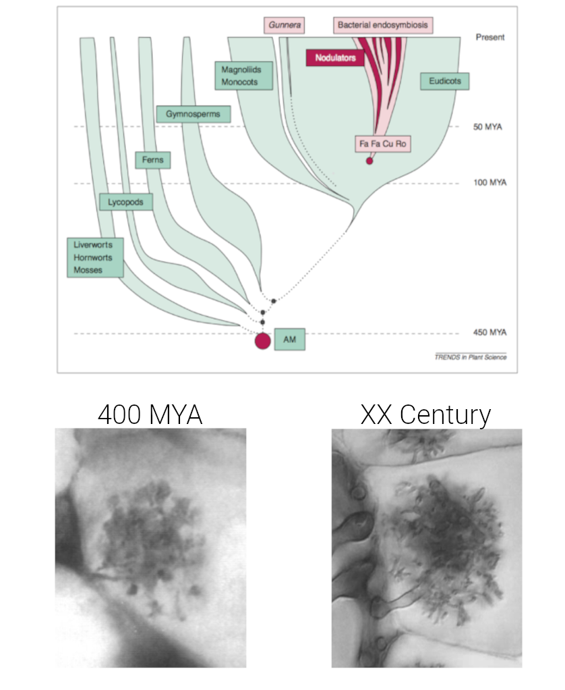
```
]]

---
background-image: url(images/parni.png)
background-size: cover


???

.h202[
- L'arbuscolo e' il cuore della simbiosi

- L'arbuscolo e' una struttura fungina altamente ramificata che che si sviluppa nelle cellule coricali delle radici delle piante

- La struttura fungina non entra a contatto con il citoplasmadella pianta

- La pianta sviluppa una struttura chiamata membrana peri arbuscolare che circonda l'arbuscolo e attraverso la quale avvengono gli scambi di sostanze nutritive e segnali
]

---

.center[.font100[**Identificare le proteine segnale localizzate sulla membrana peri arbuscolare**]]

.pull-left[
.m0tp[
.par30[
- Due piante 
    - Riso
    - Mais
- Due approcchi:
    - LCM - Transcriptomics
    - Proteomics
]
]
]

    
.pull-right[
```{r echo=FALSE, out.width="500px"}
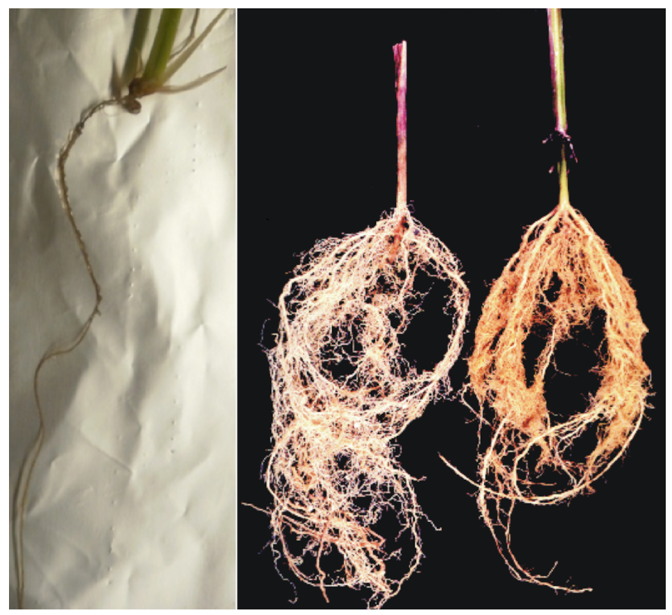
```
]

???

.h202[
- Quando arrivai a Losanna era appena stato fatto un esperimento di LCM - Transcriptomics ed erano stati identificati alcuni candidati (proteine coinvolte nel signaling situate sulla membrana peri-arbuscolare)

- L'esperimento era stato fatto su riso, quindi cominciai anch'io a lavorare su riso

- Nell'immagine di sx potete vedere una radice di riso cresciuta in modo da aumentate il numero di radici laterali, che sono quelle preferibilmente colonizzare dal fungo. Il materiale biologico e' molto esiguo e anche se il grado di colonizzazione e' molto alto, cmq la quantita' di PAM non e' molto abbondante

- Dopo circa 1 anno e mezzo di fallimenti cambiai modello sperimentale passando al mais

- Questa pianta aveva 2 enormi vantaggi: il materiale biologico era molto abbondante e quando la pianta era colonizzata le radici producevano un pigmento giallo che permetteva facilmente di arricchire il campione
]

---

.center[.font100[**Identificare le proteine segnale localizzate sulla membrana peri arbuscolare**]]

```{r echo=FALSE, out.width="650px"}
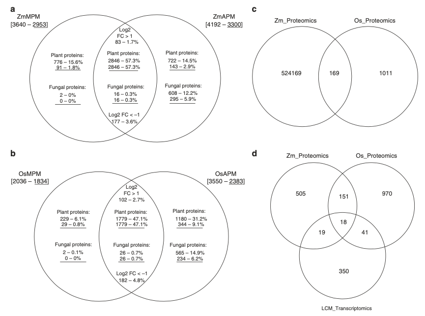
```

---

.center[.font100[**Identificare le proteine segnale localizzate sulla membrana peri arbuscolare**]]

```{r echo=FALSE, out.width="450px"}
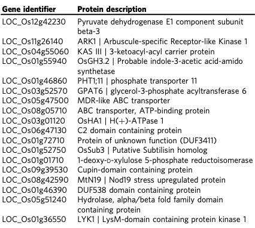
```


---

.center[.font100[**Capire la funzione dei recettori identificati**]]

.pull-left[
.m0tp[
.par25[
- Analisi della localizzazione
    - LYK1-mRFP non detectata
    - ARK1-mRFP localizzata sulla PAM
<br>
<br>
- Analisi funzionale
    - *lyk1* mutants (Tos17 insertions): nessun effetto
    - *ark1* mutants (Tos 17 insertion): necessario per il mantenimento della simbiosi
]
]
]

    
.pull-right[
```{r echo=FALSE, out.width="300px"}
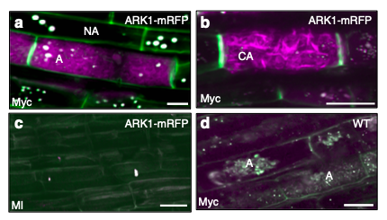
```
```{r echo=FALSE, out.width="300px"}
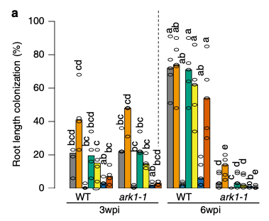
```
.right[.font50[(Roth, Chiapello et al. 2018)]]
]

---

.center[.font100[**Capire la funzione dei recettori identificati**]]

.pull-left[
.m0tp[
.par25[
- Analisi della localizzazione
    - LYK1-mRFP non detectata
    - ARK1-mRFP localizzata sulla PAM
<br>
<br>
- Analisi funzionale
    - *lyk1* mutants (Tos17 insertions): nessun effetto
    - *ark1* mutants (Tos 17 insertion): necessario per il mantenimento della simbiosi
]
]
]

    
.pull-right[
```{r echo=FALSE, out.width="350px"}
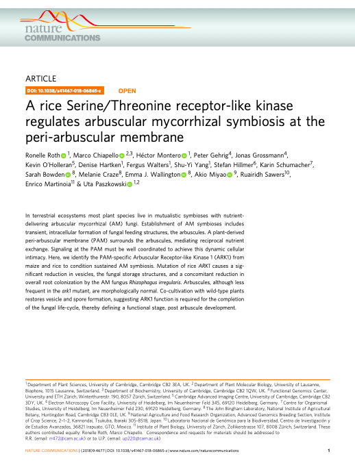
```
]

---

layout: true

# Virus detection

---

class: inverse, middle, center 

----

.font70[.grey[mycoviruses as biocontrol agents]]
---

.pull-left[
.font100[*Plasmopara viticola*]
.m0tp[
.par25[
- *Plasmopara viticola* e' un oomicete, originario dell'America importato e accidentalmente in Europa intorno al 1878
- *P. viticola* causa la peronospora della vite, una delle piu' diffuse e pericolose malattie della vite
- Causando perdite per millioni di euro all'anno
- Contenuta con pesticidi chimici
]

.content-box-red2[Identificare specifici micovirus di *P. viticola* da utilizzare come agenti di biocontrollo]

]
]
    
.pull-right[
```{r echo=FALSE, out.width="300px"}
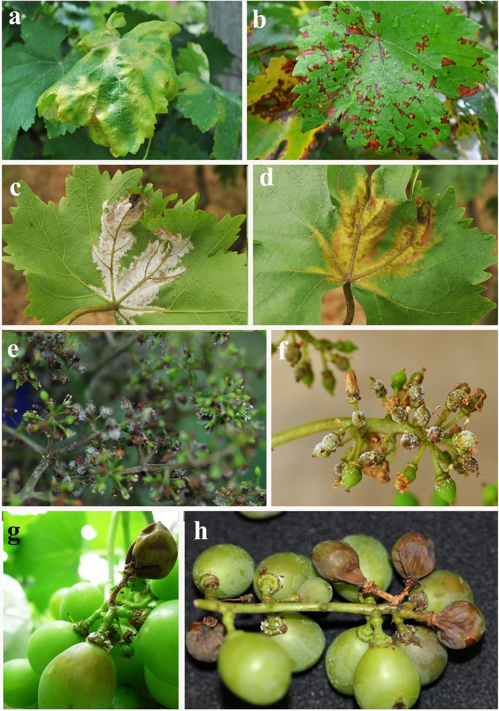
```
.right[.font50[Zhang et al., 2017]]
]

???
.h202[
- P.viticola e' un oomicete diffusosi in Europa alla fine dell'800
- E' di origine Americana e causa la malattia della vite nota come Peronospora che causa ogni anni milioni di euro di danni

- L'obiettivo del progetto era identifivare specifici virus di P. viticola da utilizzare come agenti di biocontrollo
]

---

.pull-left[
.m0t[
```{r echo=FALSE, out.width="400px"}
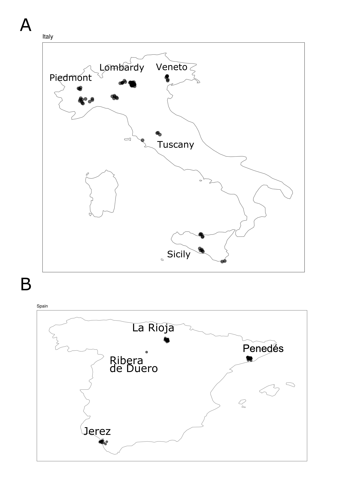
```
]]

.pull-right[
<br>
<br>
<iframe width="560" height="315" src="https://www.youtube.com/embed/9ZMrUGRzMvw?start=93" title="YouTube video player" frameborder="0" allow="accelerometer; autoplay; clipboard-write; encrypted-media; gyroscope; picture-in-picture" allowfullscreen></iframe>
]

???
.h202[
 
]

---

.pull-left[
.m0tp[
.par25[
- Identificati 283 virus:
    - 222 positve stranded RNA viruses
    - 29 negative stranded RNA viruses
    - 27 double stranded RNA virus
    - 5 ORFan virus

<br>
]

.content-box-red2[Notevole aumento della storia evolutiva dei micovirus]
]
]
    
.pull-right[
```{r echo=FALSE, out.width="400px"}
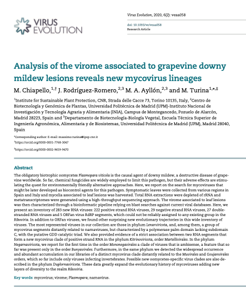
```
]

???

.h202[
- I risultati di questo lavoro ci hanno permesso di espandere enormemente la storia evolutiva dei micovirus, aumentando le specie presenti nel clade Riboviria
- Sono stati individuati, nuovi 283 virus di cui
    - 222 positve stranded RNA viruses
    - 29 negative stranded RNA viruses
    - 27 double stranded RNA virus
    - 5 virus sono stati individuati studiano la dark matter
    
- Vorrei soffermare la mia attenzione su qusti ultimi 5 virus per spiegare bene cosa si intenda per studio della dark matter e su altri 2 nuovi gruppi di virus
]

---

.pull-left[
.center[.font120[Orfanplasmovirus]]
.center[.font100[.grey[Phylum Lenarviricota]]]

.par30[
- Identificati studiando la dark matter

- Gli orfansplasmovirus formano un nuovo clade nel phylum dei Lenarviricota

- Abbondanti sia in Italia che in Spagna

- Un omologo di PVLaOrfPl2 e' stato identificato come l' RNA1 di un virus bipartito
]
]
    
.pull-right[
```{r echo=FALSE, out.width="300px"}
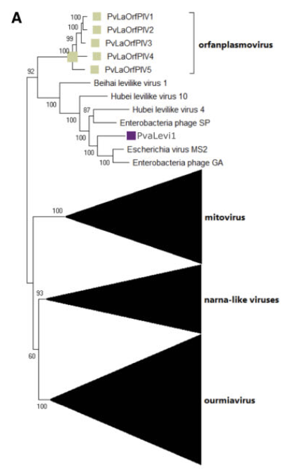
```
]

???

.h202[
- La nostra pipeline si basa su omologia con virus gia' presenti in NCBI per identificare nuovi virus.

- Questo approccio impedisce di identificare nuovi virus che non presentano omologie in NCBI

- Applicando una serie di filtri:
    - Contigs piu lunghi di 1000
    - Che codificano per una protein adi almeno 150 aminoacidi
    - Che non presentano tutte le reads su un senso o sull'altro (perche e' tipico dei virus che replicano presentare sia lo strand piu' che lo strand meno)

- Questi virus, presente abbondantemente sia in Italia che in Spagna, formano un nuovo clade nel phylum dei Lenarviricota

- Recentemente un omologo di uno degli orfanplasmo e' stato identificato in un esperimento di metatranscrittomica su insetto come l'RNA1 di un virus bipartito. Questo ci permettera' di cercare nelle nostre librerie di peronospora l'RNA2 associato ai nostri ORFanplasmovirus
]


---

.pull-left[
.center[.font120[Mononegaambi virus]]
.center[.font100[.grey[Phylum Negarnaviricota]]]

.par30[
- Gruppo di virus ambisenso

- Raggruppati filogeneticamente in un unico clade

- Non abbiamo identificato il genoma completo per tutti
]
]
    
.pull-right[
```{r echo=FALSE, out.width="750px"}
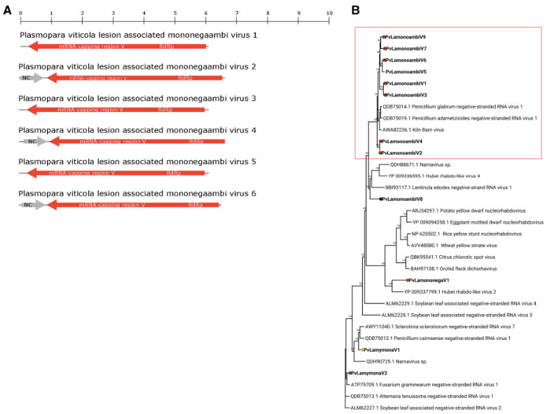
```
]

???

.h202[
- Il secondo esempio di virus identificati e' nell'ordine dei Mononegavirales, phylum Negarnaviricota
- Abbiamo identificato per la prima volta un gruppo di virus ambisenso
- Una caratteristica che fino ad ora era stata vista solo nell'ordine Bunyavirales
- Questo gruppo di virus, filogeneticamente simili, presenta una RdRp con un'orienzazione genomica antisenso e una piccola ORF in direzione opposta che codifica per il nucleocapside
- Alcuni dei virus in questo gruppo non presentano la piccola ORF in direzione senso, ma sono anche i piu' corti e riteniamo che non siano completi
]


---


class: clear middle center

```{r echo = FALSE, out.width="550px"}
knitr::include_graphics("images/today.png")
```

???

.h202[
- Vorrei ora passare al presente
- Attualmente sto lavorando su 3 progetti
    - Un progetto in collaborazione con la Prof. Caruso dell'Universita della Tuscia
    - Un progetto in collaborazione con Mata vallino
    - La stesura finale di un articolo di analisi del viroma di insetti

]

---
layout: true

# Progetti correnti

---
.pull-left[
.m0tp[
.center[.font100[**Antartica**]]
.par25[
- *Colobanthus quietensis*
- Angiosperma
- Diffusa in America centrale, sud America e nella penisola Antartica
]
```{r echo=FALSE, out.width="400px"}
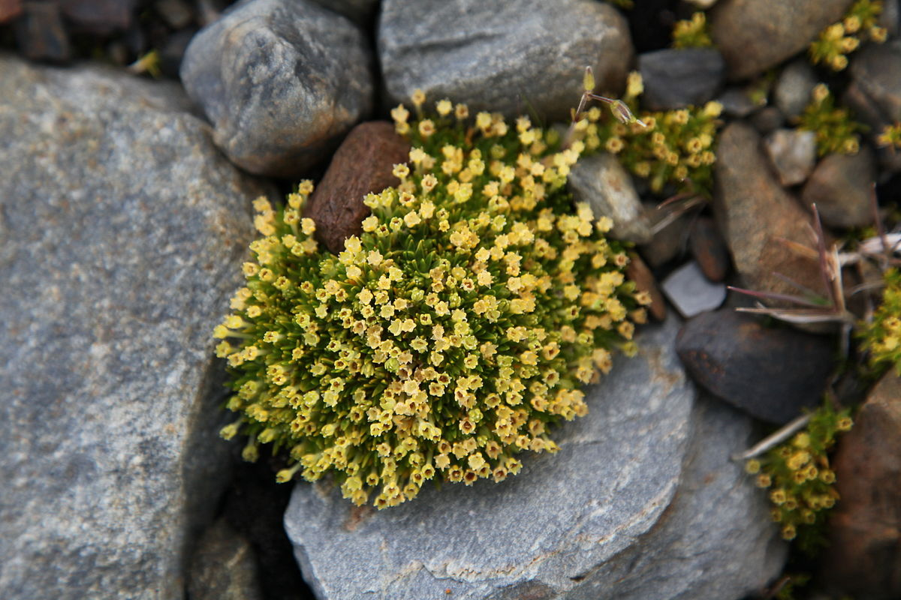
```
]
]


.pull-right[
.m0tp[
.center[.font100[**Phaser**]]
.par25[
- Phage search in insect vector microbiome
- Individuare batteriofagi in insetti
- Approccio innovativo con l'utilizzo di dati trascrittomici
]
```{r echo=FALSE, out.width="400px"}

```
]
]

???

.h202[
- Antatica
    - Il progetto prevede di rianalizzare dati di transcrittomica ottenuti da Colobanthus quietensis cresciuta in Antartide in due condizioni: all'aperto e protetta
    - Questa pianta è molto interessante perche' e' una delle poche angiosperme che possono sopravvivere in Antardide
    - Sebbene la pianta sia anche diffusa in America Centrale e meridionale

 - Phaser
    - L'acronimo Phaser sta per Phage search in insect vector microbiome 
    - Lo scopo del progetto e' di studiare la presenza di batteriofagi in insetti vettori di malattie delle piante con due approcci: un approccio bioinformatico e un approccio di  microscopia
    - L'innovazione del progetto risiede nell'utilizzare dati di trascrittomica per individuare i phagi presenti
    
 ]

---

.center[.fon120[**Virome associated to thrips species**]]

.limg[
    
```{r echo=FALSE, out.width="400px"}
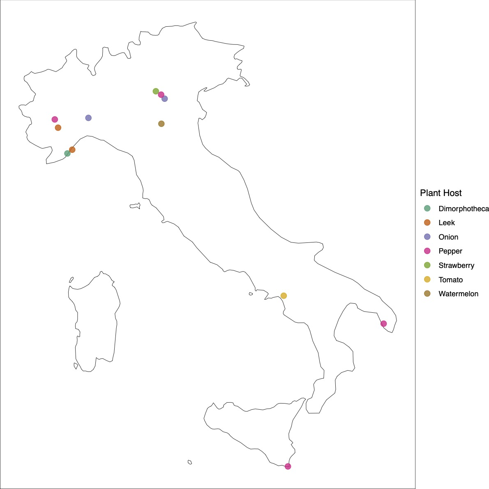
```
```{r echo=FALSE, out.width="300px"}
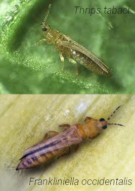
```
]

???

.h202[
- Il terzo progetto di cui vi vorrei parlare ha come obiettivo la definizione del viroma di due insetti vettori: F. occidentalis e T. tabaci
- Sono stai campionati tra il 2018 e il 2020 principalmente in diverse parti d'Italia, piu' una zona degli Stati uniti e una localita' in Jordania
- L'aspetto innovativa del progetto, che rientra sempre nel progetto europeo VIROPLANT, e' stato quello di non aver solo identificato il viroma di questi due insetti ma anche di aver tracciato la presenza dei virus identificati negli anni successivi a quello di campionamento
]

---

.center[.fon120[**Virome associated to thrips species**]]

<br><br>

.center[.font200[DEMO]]
.center[https://thrips-virusmap.herokuapp.com/]

???

.h202[
- Per presentarvi i risultati di questo lavoro vorrei utilizzare l'applicazione sviluppata, allegata all'articolo, che verra' sottomesso in questi giorni, che permette di esaminare nel dettaglio i dati ottenuti
]

---

class: clear middle center

```{r echo = FALSE, out.width="850px"}
knitr::include_graphics("images/sideProj.png")
```

???

.h202[
- Mi piacerebbe presentarvi brevemente alcuni side project sviluppati in questi anni 
]

---
layout: true

# Side projects

---

.center[.font120[Collaborazioni]]

.pull-left[
.m0tp[
.center[.font100[**Ramf**]
.grey[(Prof. Gutjhar)]]
.par25[
- Framework statistico per l'analisi dei dati di colonizzazione
]
<br>
```{r echo = FALSE, out.width="150px"}
knitr::include_graphics("images/ramf.png")
```
.center[.font50[https://github.com/mchiapello/Ramf]]
]
]

.pull-left[
.m0tp[
.center[.font100[**Rwaves**]
.grey[(Prof. Bosco)]]
.par25[
- Framework statistico per l'analisi dei dati di elettropenetrazione
]
<br>
```{r echo = FALSE, out.width="150px"}

```
.center[.font50[https://github.com/mchiapello/Rwaves]]
]
]

---

.center[.font120[*Plasmopara viticola* virome byproduct]]

.pull-left[
.m0tp[
.par30[
- Identificati molti virus noti di vite
<br>
<br>
- Un nuovo ilarvirus di vite
<br>
<br>
- Tre phenui-like virus
<br>
<br>
- Identificato una associazione tra un flavi-like virus e un virga-like virus a cui abbiamo dato il nome di jivivirus
]
]
]

    
.pull-right[
```{r echo=FALSE, out.width="300px"}
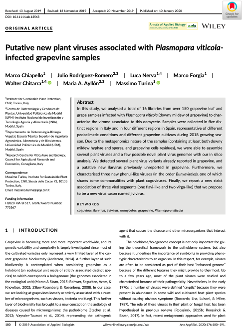
```
]

???

.h202[
- Un interessante lavoro e' nato come byprodact piu che come side project
- Durante le analisi dei dati di metatrascrittomica di Plasmopara viticola ci siamo accorti della presenza di sequenze di virus di pianta nei nostri campioni
- Questa contaminazione era sicuramente dovuta al sistema di campionamento, che come ricorderete prevedeva lo spazzolomento delle foglie, causando sicuramente anche il distacco di epitelio fogliare 
- Questi nuovi virus provengono da questo materiale
- La presenza della Movement protein nel genoma di questi virus altamente simile a quella di virus che infettano piante ci ha permesso di classificarli come virus di pianta, anche se non sempre con estrema certezza
]

---

.center[.font120[*Plasmopara viticola* virome byproduct]]

.pull-left[
.m0tp[
.par30[
- Identificati molti virus noti di vite
<br>
<br>
- Un nuovo ilarvirus di vite
<br>
<br>
- Tre phenui-like virus
<br>
<br>
- Identificato una associazione tra un flavi-like virus e un virga-like virus a cui abbiamo dato il nome di jivivirus
]
]
]

    
.pull-right[
```{r echo=FALSE, out.width="400px"}
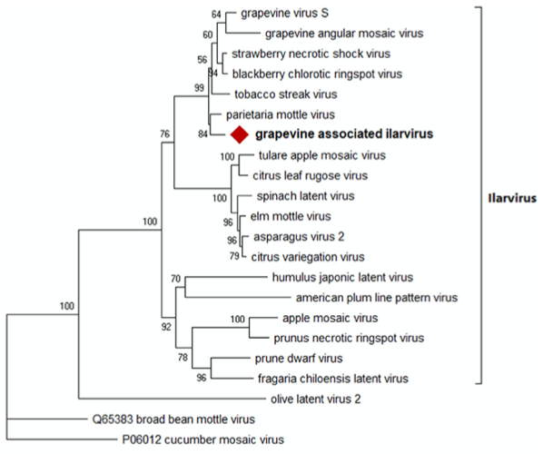
```
]

???

.h202[
- Abbiamo identificato un nuovo tripartito in tutti i campioni italiani e un campione spagnolo
- L'analisi filogenetica colloca questo virus nel genere Ilarvirus
]

---

.center[.font120[*Plasmopara viticola* virome byproduct]]

.pull-left[
.m0tp[
.par30[
- Identificati molti virus noti di vite
<br>
<br>
- Un nuovo ilarvirus di vite
<br>
<br>
- Tre phenui-like virus
<br>
<br>
- Identificato una associazione tra un flavi-like virus e un virga-like virus a cui abbiamo dato il nome di jivivirus
]
]
]

    
.pull-right[
```{r echo=FALSE, out.width="450px"}
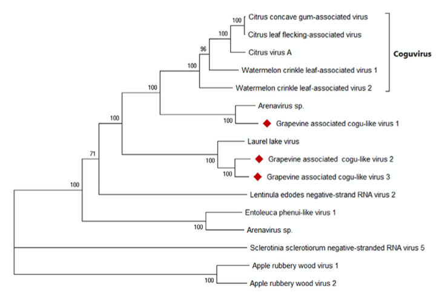
```
]

???

.h202[
- Sono stati identificati tre virus strettamente correlati ai phenuivirus, un gruppo di virus negativi di insetti dell'ordine Bunyavirales
- Tutti e tre presentano un genoma tripartito al contrario dei quanto succede per i veri coguvirus in cui la Movemento protein e il nucleocapside sono sullo stesso segmento
- Nonostante questo altri phenui virus sono riportati con un'organizzazione genomica tripartita
]

---

.center[.font120[*Plasmopara viticola* virome byproduct]]

.pull-left[
.m0tp[
.par30[
- Identificati molti virus noti di vite
<br>
<br>
- Un nuovo ilarvirus di vite
<br>
<br>
- Tre phenui-like virus
<br>
<br>
- Identificato una associazione tra un flavi-like virus e un virga-like virus a cui abbiamo dato il nome di jivivirus
]
]
]

    
.pull-right[
```{r echo=FALSE, out.width="500px"}
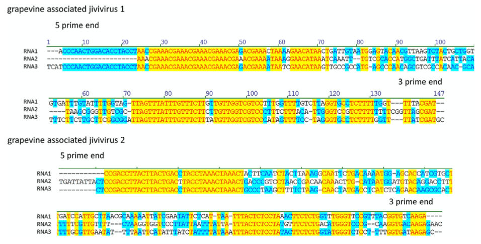
```
]

???

.h202[
- La concomitante presenza di tre contigs in diverse librerie ci ha permesso di ipotizzare che facessero parte dello stesso virus
- La nostra ipotesi e' stata confermata tramite RT-PCR e l'allineaminteo del 5' e 3'
- Permettendoci di definire un nouvo taxon virale chiamato : jiviviruses
]

---
<br>
<br>
<br>
.center[.font200[IBiG]]
.center[https://carpentries.org/]

???

.h202[
- L'ultimo side proget che vorrei brevemente menzionare, ma a cui temgo molto e' il gruppo di lavoro IBiG di cui vi ho parlato durante la conferenza di istituto.
- tengo molto ad IBiG perche mette insieme 2 aspetti fondamentali della mia carriera negli ultimi anni: 
    - La bioinformatica 
    - L'insegnamento

- nel 2017 ho ottenuto la qualifica di istruttore di Data and Software Carpentry rilasciato dalla fondazione internazionale The Carpentries e tra il 2017 ad oggi ho tenuto piu di 10 corsi di analisi dati con R in molte universita' Europee e spero di trasmettere quanto imparato nei corsi che proporremo come IBiG
]
---

class: clear middle center

```{r echo = FALSE, out.width="850px"}
knitr::include_graphics("images/future.png")
```

---

layout: false

# Idee per il futuro

<br>
<br>

.par30[
1. Continuare lo studio dell'ecologia virale
    - Nelle simbiosi micorriziche arbuscolari
    - Nella tolleranza ai metalli pesanti

1. Sviluppare collaborazioni e progetti nell'ambito dell'IBiG
    - Diventare punto di riferimento per l'IPSP

1. Approccio proteomico

]

---

class: clear middle center

```{r echo = FALSE, out.width="1050px"}
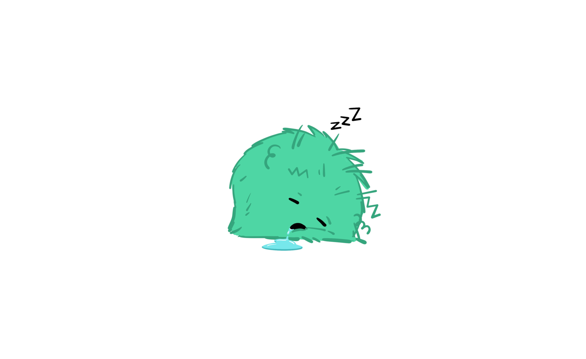

```

---

class: clear middle center

```{r echo = FALSE, out.width="1050px"}
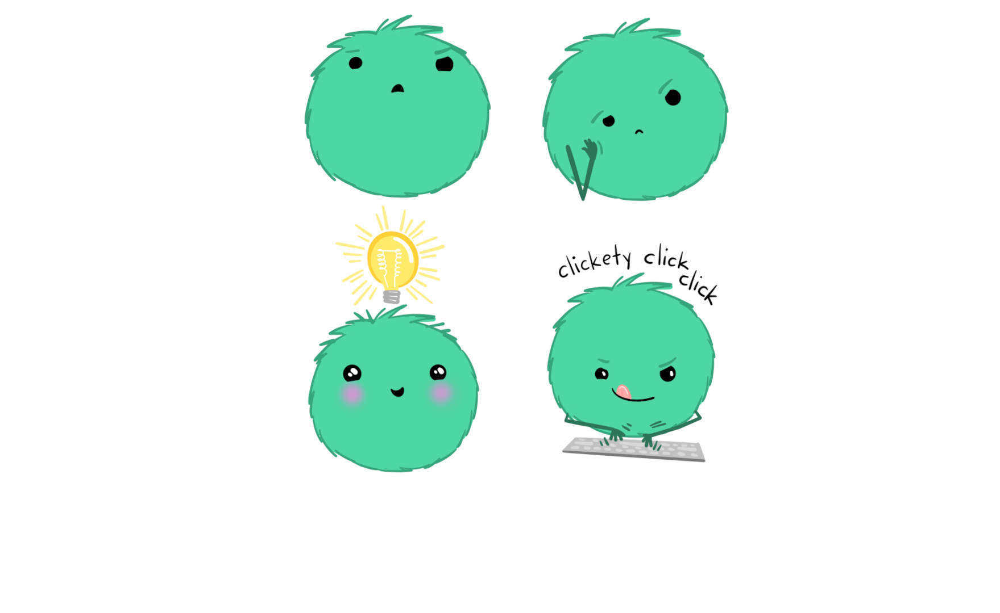

```


???

.h202[
- Se avete dubbi, perplessita', suggerimenti posso rispondere ora ad alcune domande oppure potete contattarmi per eventuali approfondimenti.
]

---

class: clear middle

`r fontawesome::fa("globe", fill = "grey")` https://mchiapello.netlify.app/

`r fontawesome::fa("skype", fill = "lightblue")`  marpello

`r fontawesome::fa("envelope", fill = "lightred")` marco.chiapello@ipsp.cnr.it

`r fontawesome::fa("envelope", fill = "lightred")` chiapello.m@gmail.com

`r fontawesome::fa("github", fill = "black")` mchiapello

 
???

.h202[
- Grazie per l'attenzione
]
